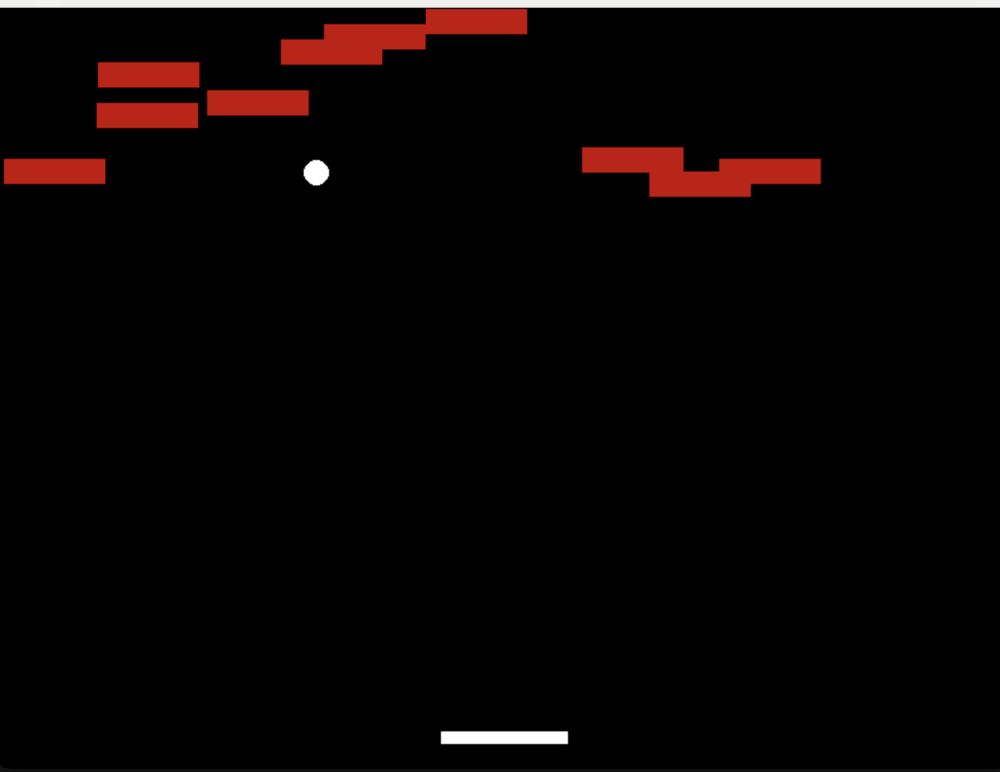
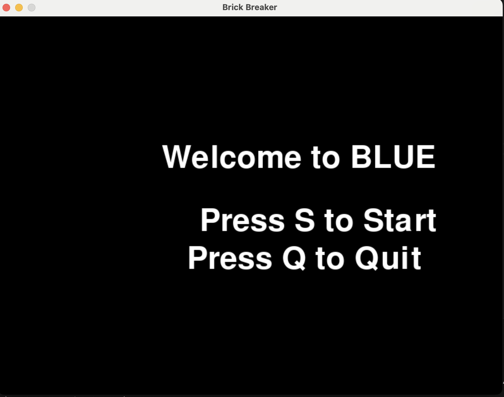

:warning: Everything between << >> needs to be replaced (remove << >> after replacing)

# Deep Blue !
## CS110 Final Project  Spring, 2024

## Team Members

David Schramm

***

## Project Description

This project creates a game similar to  Brick-Breaker, but ups the challenge by using a single ball which must be kept up with a controlled paddle to destroy all the bricks. If the ball is allowed to touch the ground, the game is lost.
***    

## GUI Design

### Initial Design

 
- Originally had a stationary cannon shooting multiple balls but ran into troubles with too many interactions, this is initial printed balal values

### Final Design

 

## Program Design
- Randomly generate bricks, continuously check for collisions between the ball and bricks or screen and if there are no bricks, end game
### Features

1. Moving objects
2. Object Collisions
3. Start Menu
4. Random brick generation
5. Win and Loss Condition

### Classes
- "Ball": Handles dynamics of ball in the game
- "Paddle": Relays player's inputs for paddle movement to interact with ball
- "Brick": Properties for each brick and their collision handling

## ATP

| Step                 |Procedure                                 |Expected Results                         |
|----------------------|:---------------------------------------: |----------------------------------------:|
|  1.                  | Run BLUE program with "python3 main.py". | GUI window appears with title screen    |
|  2.                  | Press "S" to Start or "Q" to Quit title  | "S" - Screen switches to game screen,   |
|                      |screen.                                   | bricks, ball, and paddle generated.     |
|                      |                                          | "Q" - closes window.                    |
|  3.                  | Move paddle under the ball by pressing   | Paddle moves accordingly with individual|
|                      | the "right" or "left" arrow keys.        | arrow key press.                        | 
|  4.                  | When the ball collides with a brick,     | Ball bounces off sides of screen and    |
|                      | anticipate its path and keep it up with  | paddle. When all bricks are removed(win)|
|                      | the paddle until all bricks are removed. | window is closed. If ball touches bottom|                        
|                      |                                          | of screen(loss), window is closed.      |                           
|                      |                                          |                                         |